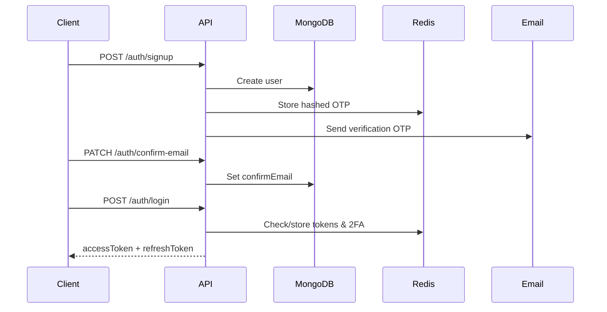

# Anonify (Saraha App)

A **Node.js / Express** REST API for anonymous messaging and user profiles—similar in spirit to [Saraha](https://www.sarahah.com) / Sarahah. Users can share a public profile link, receive messages from anyone (signed-in or not), and manage their account with email verification, optional two-factor authentication, and Google sign-in.

---

## Features

### Authentication & security
- Email/password signup with **OTP email verification**
- Login with **JWT access + refresh tokens** (stored/revoked via **Redis**)
- **Google OAuth** sign-in/sign-up via ID token
- **Two-factor authentication (2FA)** via email OTP
- Password reset via **OTP** or **magic link** (one-time use, Redis-backed)
- OTP rate limiting and temporary blocks (Redis)
- Password hashing (bcrypt / argon2) and optional field encryption for sensitive data (e.g. phone)
- Token rotation and logout (single device or all sessions)

### User profiles
- Authenticated profile endpoint
- **Shareable public profile** (`GET /user/:userId/share-profile`) with visit counter
- Profile and cover image upload (Multer, served under `/uploads`)
- Change password with password history checks

### Messages
- Send anonymous or authenticated messages to a user by `receiverId`
- Text content and/or image attachments (up to 2 files)
- List, view, and delete received messages (delete restricted to receiver)

---

## Tech stack

| Layer        | Technology                          |
|-------------|--------------------------------------|
| Runtime     | Node.js (ES modules)                 |
| Framework   | Express 5                            |
| Database    | MongoDB (Mongoose)                   |
| Cache       | Redis                                |
| Validation  | Joi                                  |
| Auth        | JWT, Google Auth Library             |
| Email       | Nodemailer (event-driven OTP emails) |
| Uploads     | Multer                               |

---

## Project structure

```
saraha-app/
├── config/
│   ├── config.service.js      # Env loading & exported config
│   ├── .env.development       # Local env (not in git)
│   └── .env.production        # Production env (not in git)
├── src/
│   ├── main.js                # Entry point
│   ├── app.bootstrap.js       # Express app, routes, middleware
│   ├── DB/                    # MongoDB connection, models, repository
│   ├── common/                # Enums, Redis, security, email, responses
│   ├── middleware/            # Auth & Joi validation
│   └── modules/
│       ├── auth/              # Signup, login, 2FA, password reset
│       ├── user/              # Profile, tokens, images
│       └── message/           # Send & manage messages
├── uploads/                   # Static files (created at runtime)
└── package.json
```

---

## Prerequisites

- **Node.js** 18+ (recommended; uses native `--watch-path`)
- **MongoDB** instance
- **Redis** instance
- **SMTP / Gmail app password** (for OTP and notification emails)
- **Google Cloud OAuth client ID** (optional, for Google sign-in)

---

## Installation

```bash
git clone <repository-url>
cd saraha-app
npm install
```

---

## Configuration

Environment files live under `config/` and are loaded by `NODE_ENV`:

| `NODE_ENV`      | File                          |
|-----------------|-------------------------------|
| `development`   | `config/.env.development`     |
| `production`    | `config/.env.production`      |


## Running the app

**Development** (with file watch):

```bash
npm run start:dev
```

**Production:**

```bash
npm run start:prod
```

Default URL: `http://localhost:7000` (or your `PORT`).

Health check: `GET /` → `Hello World!`

Static uploads: `GET /uploads/...`

---

## API overview

Base URL: `http://localhost:<PORT>`

### Response format

Successful responses:

```json
{
  "message": "Success",
  "status": 200,
  "data": { }
}
```

Protected routes expect:

```http
Authorization: Bearer <access_token>
```

---

### Auth — `/auth`

| Method | Endpoint | Auth | Description |
|--------|----------|------|-------------|
| `POST` | `/signup` | No | Register (`fullName`, `email`, `password`, `phone`, `confirmPassword`). Query: `?lang=ar\|en` |
| `PATCH` | `/confirm-email` | No | Verify email with OTP |
| `PATCH` | `/resend-confirm-email` | No | Resend verification OTP |
| `POST` | `/login` | No | Login; returns tokens or 2FA challenge |
| `POST` | `/login-confirm` | No | Complete login after 2FA OTP |
| `POST` | `/signup/gmail` | No | Google sign-in/up (`idToken` in body) |
| `POST` | `/forgot-password` | No | Request reset (`method`: `otp` or `link`) |
| `POST` | `/verify-otp` | No | Verify reset OTP |
| `GET` | `/verify-link` | No | Verify magic link (`?token=`) |
| `PATCH` | `/reset-password` | No | Set new password after verification |
| `PATCH` | `/request-2fa` | Yes | Request 2FA setup code |
| `PATCH` | `/enable-2fa` | Yes | Enable 2FA with OTP |

---

### User — `/user`

| Method | Endpoint | Auth | Description |
|--------|----------|------|-------------|
| `GET` | `/` | Yes | Current user profile |
| `POST` | `/logout` | Yes | Logout (body `flag` for all devices vs current) |
| `POST` | `/rotate-token` | Refresh token | Issue new access/refresh pair |
| `GET` | `/:userId/share-profile` | Optional | Public profile for messaging link |
| `PATCH` | `/profile-image` | Yes | Upload profile picture (`attachment`) |
| `DELETE` | `/remove-profile-image` | Yes | Remove profile picture |
| `PATCH` | `/profile-cover-image` | Yes | Upload cover images (`attachments`, max 5) |
| `PATCH` | `/change-password` | Yes | Change password; returns new tokens |

---

### Messages — `/message`

| Method | Endpoint | Auth | Description |
|--------|----------|------|-------------|
| `POST` | `/:receiverId` | Optional | Send message (anonymous if no token). Body: `content`; files: `attachments` (max 2 images) |
| `GET` | `/` | Yes | List messages for current user |
| `GET` | `/:messageId` | Yes | Get one message |
| `DELETE` | `/:messageId` | Yes | Delete message (receiver only) |

---

## Authentication flow (summary)



1. **Signup** → email OTP → **confirm-email**
2. **Login** → JWT credentials (or 2FA email → **login-confirm**)
3. Use **access token** on protected routes; refresh via **rotate-token** with refresh token
4. **Logout** revokes tokens in Redis

---

## Anonymous messaging

1. User shares profile: `GET /user/:userId/share-profile`
2. Anyone posts: `POST /message/:receiverId` with optional `Authorization` header
3. Receiver lists/deletes via authenticated `/message` routes

Messages without a sender are stored with no `senderId` (fully anonymous).

---

## Scripts

| Command | Description |
|---------|-------------|
| `npm run start:dev` | Development with `NODE_ENV=development` and file watch |
| `npm run start:prod` | Production with `NODE_ENV=production` |

---

## License

ISC

---
